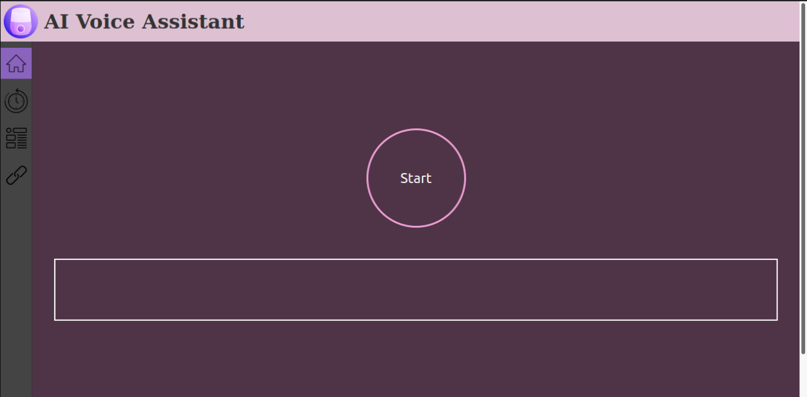
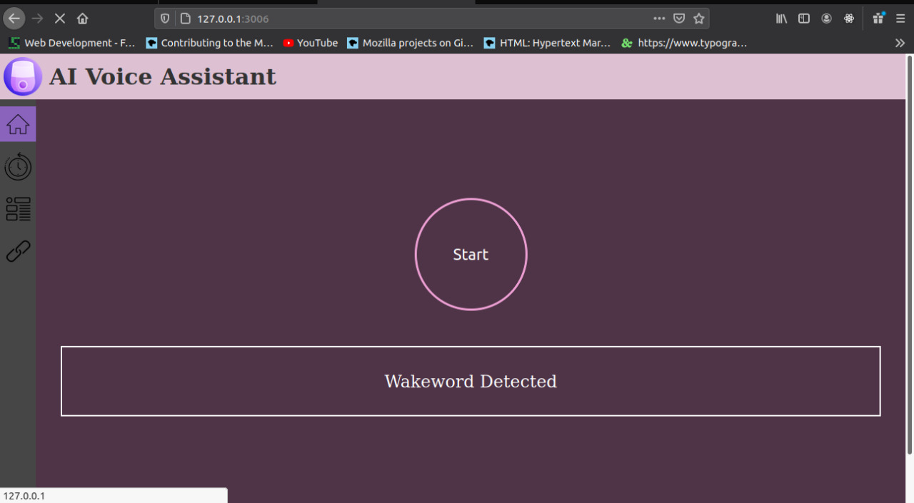
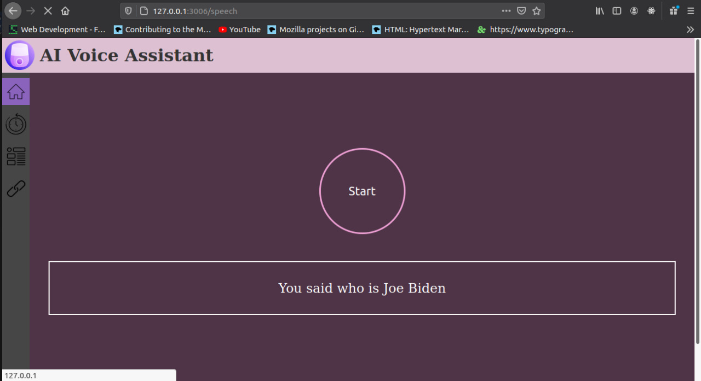
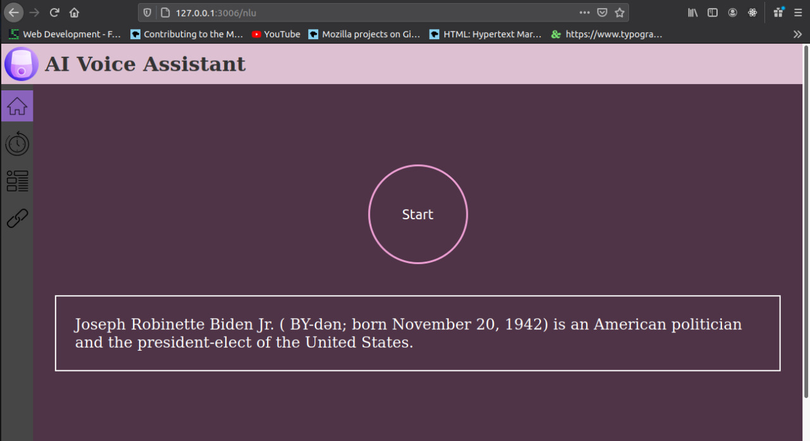

## This is a AI Voice Assisstant based on Deep Learning which runs on flask at its backend


# Steps to run this
*  #### Clone the repository in a local directory
*  #### Create a Virtual Environment on your machine
* #### To create Virtual Environment on your machine use the following commands

For Windows:
 ```
  python -m venv ocr-env
  ocr-env\Scripts\activate.bat
 ```
  
 For Linux or Mac:
  ```
  python3 -m venv ocr-env
  source tutorial-env/bin/activate
 ``` 
 * #### To install all the requirements go into the directory of flask_api and run the following command
 ```
 pip install -r requirements.txt
 ```
 * #### Next step will be to download the models to run this file
 
   * ##### Models of TextToSpeech
     * [ssrn](https://drive.google.com/file/d/1q1OWI8i8QAph3LNbU1imwiNaXvjuHIqv/view?usp=sharing)
     * [text2mel](https://drive.google.com/file/d/1DXTqBWtkVlEDp15a4bGNn5YBMJZ9c9ow/view?usp=sharing)
     
   * ##### Models of SpeechToText
      * [pbmm]( https://github.com/mozilla/DeepSpeech/releases/download/v0.9.2/deepspeech-0.9.2-models.pbmm)
      * [scorrer](https://github.com/mozilla/DeepSpeech/releases/download/v0.9.2/deepspeech-0.9.2-models.scorer)
 
 * #### Next step will be to paste them into their required directory

 * #### Now run app.py from the same directory
 * #### Click on the link that is displayed in the terminal, after that your AI Voice Assistant should get opened as a Web Application 
  
  
  
  
  
  #### Have fun using your new and easy to use privacy friendly Voice Assisstant !!!
